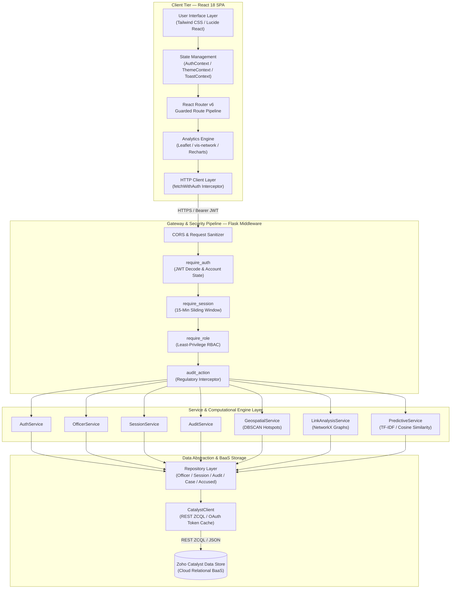
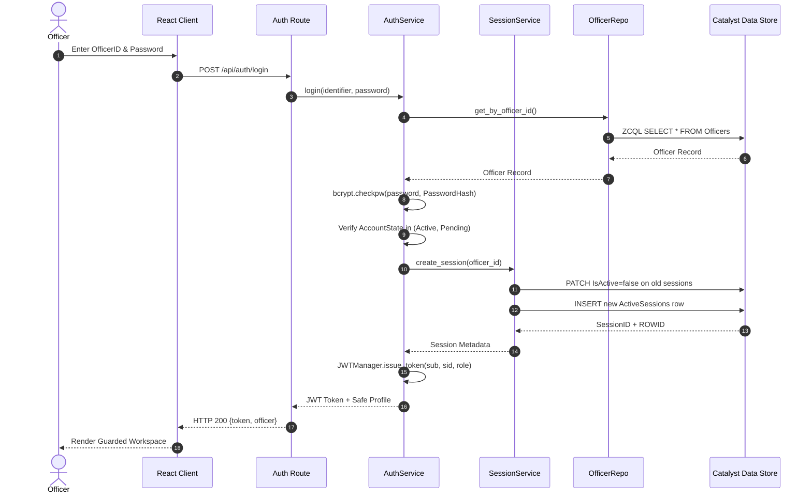
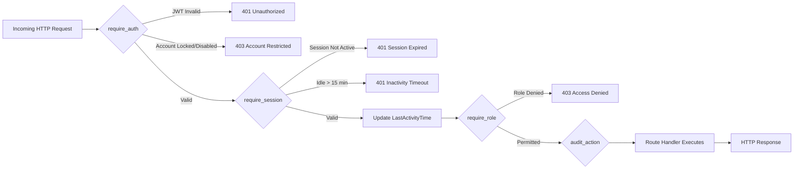
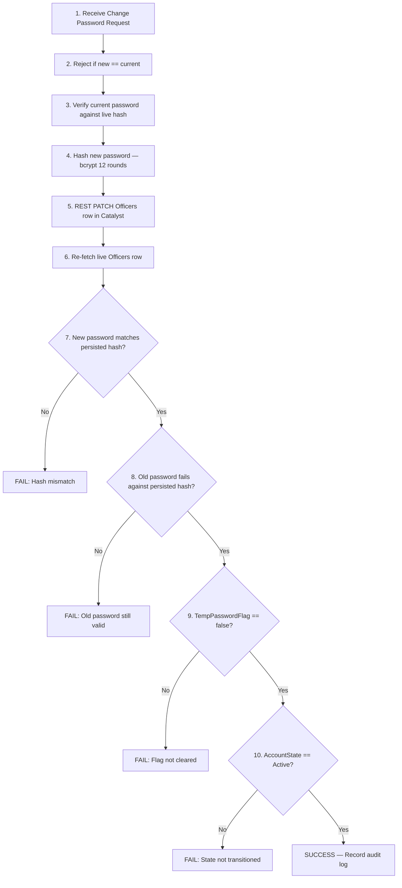

# Sentinel-KSP

> Karnataka State Police — Crime Intelligence & Cyber Command Platform

[](https://www.python.org/)
[](https://flask.palletsprojects.com/)
[](https://react.dev/)
[](https://www.zoho.com/catalyst/)
[](https://scikit-learn.org/)

Sentinel-KSP is a full-stack crime intelligence and cyber command platform built for the Karnataka State Police. It combines a React single-page application with a Flask backend deployed on Zoho Catalyst Advanced Functions, providing statewide crime analytics, geospatial hotspot detection, entity-link investigation, predictive risk scoring, and a complete officer lifecycle and session governance system.

---

## Table of Contents

- [Architecture](#architecture)
- [Modules](#modules)
- [Tech Stack](#tech-stack)
- [Getting Started](#getting-started)
- [API Reference](#api-reference)
- [RBAC & Security Model](#rbac--security-model)
- [Repository Layout](#repository-layout)
- [Testing](#testing)
- [Deployment](#deployment)
- [High-Level Design (HLD)](#high-level-design-hld)

---

## Architecture

> 📖 **High-Level Design**: For the full enterprise architecture specification, computational formulas, sequence flows, and RBAC matrix, see [docs/HLD.md](docs/HLD.md) or the [embedded HLD section below](#high-level-design-hld).

```text
┌──────────────────────────────────────────────────────────────┐
│                    React SPA (client/)                        │
│  AuthContext → Guards → AppShell → Permission-gated Pages    │
└────────────────────────┬─────────────────────────────────────┘
                         │ HTTP JSON (Bearer JWT)
                         ▼
┌──────────────────────────────────────────────────────────────┐
│              Flask API (functions/sentinel_api/)              │
│                                                              │
│  Middleware Stack:                                            │
│    require_auth → require_session → require_role → audit     │
│                                                              │
│  Route Blueprints:                                           │
│    auth_bp · admin_bp · dashboard_bp · geospatial_bp         │
│    link_analysis_bp · predictive_bp · health_bp              │
│                                                              │
│  Service Layer:                                              │
│    AuthService · OfficerService · SessionService             │
│    AuditService · DashboardService · GeospatialService       │
│    LinkAnalysisService · PredictiveService                   │
│                                                              │
│  Repository Layer:                                           │
│    OfficerRepository · SessionRepository · AuditRepository   │
│    CaseRepository · AccusedRepository · VictimRepository     │
│                                                              │
│  Core:                                                       │
│    CatalystClient · JWTManager · PasswordManager             │
│    RBAC PermissionEngine · Structured Logger                 │
└────────────────────────┬─────────────────────────────────────┘
                         │ REST ZCQL / BaaS API
                         ▼
┌──────────────────────────────────────────────────────────────┐
│             Zoho Catalyst Data Store (BaaS)                  │
│                                                              │
│  Tables: Officers · ActiveSessions · AuditLogs              │
│          CaseMaster · Accused · Victim · Unit                │
└──────────────────────────────────────────────────────────────┘
```

The backend uses the Catalyst REST ZCQL API directly (`POST /baas/v1/project/{pid}/query`) instead of the SDK's ZCQL executor, which routes through `accounts.localzoho.com` and has SSL issues in local development. The REST endpoint uses `accounts.zoho.in` and works reliably in both local and deployed environments.

---

## Modules

### Crime Intelligence & Analytics

| Module | Description |
|--------|-------------|
| **Statewide Dashboard** | Aggregated KPIs across all Karnataka districts — total cases, clearance rates, crime group breakdowns, year-over-year trends. |
| **Geospatial Intelligence** | DBSCAN spatial clustering over geocoded FIR coordinates. Produces GeoJSON hotspot maps with cluster density metadata. |
| **District Drilldown** | Police station jurisdiction volume breakdown and unit-level crime analytics. |
| **Predictive Risk Scoring** | Composite threat risk index per district using weighted crime velocity, clearance deficit, and historical trend factors. |
| **Behavioral Anomaly Detection** | Statistical anomaly detection across incident velocity and MO signature patterns. |
| **Socio-Economic Correlation** | Demographic overlay mapping crime density against population, literacy, and employment data. |

### Link Analysis & Investigation

| Module | Description |
|--------|-------------|
| **Entity Network Graph** | Force-directed graph connecting suspects, cases, and police units across jurisdictions. Uses NetworkX betweenness centrality to identify high-importance hubs. |
| **Repeat Offender Profiles** | Consolidated criminal footprint joining FIR records across multiple police jurisdictions. |
| **MO Signature Matching** | TF-IDF vectorization with cosine similarity to find cases sharing similar modus operandi patterns. |

### Cyber Command Center (Admin)

| Module | Description |
|--------|-------------|
| **Officer Management** | Create, lock, unlock, disable officer accounts. Admin-initiated password resets with temporary credential generation. |
| **Active Session Governance** | Real-time monitoring of all authenticated sessions. Force logout capability. |
| **Immutable Audit Logs** | Regulatory-grade audit trail for all authentication events, administrative actions, and data access. |
| **Security Incidents** | Automated threat detection alerts for failed login spikes, suspicious devices, and rate-limit violations. |
| **Emergency Access** | Temporary emergency access grants to classified case data with mandatory justification logging. |

---

## Tech Stack

### Frontend

| Technology | Purpose |
|------------|---------|
| React 18 | SPA framework |
| React Router v6 | Client-side routing with nested layout guards |
| Tailwind CSS | Utility-first styling |
| Framer Motion | Page transitions and micro-animations |
| Recharts | Chart and graph visualizations |
| Leaflet | Interactive GeoJSON map rendering |
| vis-network | Force-directed entity network graphs |
| Lucide React | Icon system |

### Backend

| Technology | Purpose |
|------------|---------|
| Flask | HTTP API framework |
| Flask-CORS | Cross-origin request handling |
| Zoho Catalyst SDK | Cloud BaaS integration |
| bcrypt | Password hashing (12-round salt) |
| PyJWT | JWT token issuance and verification |
| scikit-learn | DBSCAN clustering, TF-IDF vectorization, cosine similarity |
| NetworkX | Graph construction and centrality analysis |
| NumPy / Pandas | Numerical computation and data transformation |

### Infrastructure

| Technology | Purpose |
|------------|---------|
| Zoho Catalyst Advanced Functions | Serverless backend hosting |
| Zoho Catalyst Data Store | Cloud relational datastore (BaaS) |
| Zoho OAuth 2.0 (Self Client) | API authentication for Catalyst REST endpoints |

---

## Getting Started

### Prerequisites

- Python 3.10+
- Node.js 18+ and npm
- Zoho Catalyst project with Data Store tables provisioned

### 1. Clone the Repository

```bash
git clone https://github.com/Abhirupmandal/Sentinel-KSP.git
cd Sentinel-KSP
```

### 2. Environment Variables

Create a `.env` file at the repository root:

```env
CATALYST_PROJECT_ID=your_project_id
CATALYST_PROJECT_KEY=your_project_key
ZC_SDK_CLIENT_ID=your_self_client_id
ZC_SDK_CLIENT_SECRET=your_self_client_secret
ZC_SDK_REFRESH_TOKEN=your_self_client_refresh_token
CATALYST_ENV=Development
JWT_SECRET_KEY=your_jwt_secret
```

| Variable | Purpose |
|----------|---------|
| `CATALYST_PROJECT_ID` | Zoho Catalyst project ID for REST query URLs |
| `CATALYST_PROJECT_KEY` | Catalyst project key for SDK initialization |
| `ZC_SDK_CLIENT_ID` | Zoho OAuth self-client ID |
| `ZC_SDK_CLIENT_SECRET` | Zoho OAuth self-client secret |
| `ZC_SDK_REFRESH_TOKEN` | Refresh token for generating OAuth access tokens |
| `CATALYST_ENV` | Catalyst environment header (`Development` or `Production`) |
| `JWT_SECRET_KEY` | Secret key for JWT token signing and verification |

### 3. Install Backend Dependencies

```bash
pip install -r requirements.txt
pip install bcrypt pyjwt
```

### 4. Install Frontend Dependencies

```bash
cd client
npm install
cd ..
```

### 5. Start the Backend

```bash
python functions/sentinel_api/main.py
```

The Flask server binds to `http://localhost:5000`.

### 6. Start the Frontend

```bash
cd client
npm start
```

The React dev server runs on `http://localhost:3000` and proxies API requests to the backend.

---

## API Reference

### Authentication (`/api/auth`)

| Method | Route | Auth | Description |
|--------|-------|------|-------------|
| POST | `/api/auth/login` | Public | Authenticate officer, issue JWT |
| POST | `/api/auth/logout` | JWT + Session | Terminate active session |
| GET | `/api/auth/profile` | JWT + Session | Retrieve authenticated officer profile |
| GET | `/api/auth/me` | JWT + Session | Alias for `/profile` |
| PUT | `/api/auth/change-password` | JWT + Session | Change officer password |

### Admin — Cyber Command Center (`/api/admin`)

All admin endpoints require `CyberSecurityAdministrator` role.

| Method | Route | Description |
|--------|-------|-------------|
| POST | `/api/admin/create-user` | Provision new officer account |
| POST | `/api/admin/reset-password` | Admin-initiated password reset |
| POST | `/api/admin/lock-account` | Lock officer account |
| POST | `/api/admin/unlock-account` | Unlock officer account |
| POST | `/api/admin/force-logout` | Terminate officer session |
| GET | `/api/admin/active-sessions` | List all active sessions |
| GET | `/api/admin/audit-logs` | Query immutable audit trail |
| POST | `/api/admin/emergency-access` | Grant emergency access |
| POST | `/api/admin/emergency-access/end` | Revoke emergency access |
| GET | `/api/admin/security-incidents` | List security incidents |
| GET | `/api/admin/officers` | List all officers (REST alias) |
| POST | `/api/admin/officers` | Create officer (REST alias) |

### Dashboard (`/api/dashboard`)

| Method | Route | Permission | Description |
|--------|-------|------------|-------------|
| GET | `/api/dashboard/stats` | `DASHBOARD_VIEW` | Statewide crime KPIs and aggregations |

### Geospatial Intelligence (`/api/spatial`)

| Method | Route | Permission | Description |
|--------|-------|------------|-------------|
| GET | `/api/spatial/hotspots` | `GEOSPATIAL_VIEW` | DBSCAN clustered GeoJSON hotspot data |
| GET | `/api/spatial/district-drilldown` | `GEOSPATIAL_VIEW` | District and station-level breakdowns |
| GET | `/api/spatial/spike-detection` | `GEOSPATIAL_VIEW` | Crime velocity spike detection |

### Link Analysis (`/api/graph`)

| Method | Route | Permission | Description |
|--------|-------|------------|-------------|
| GET | `/api/graph/network` | `LINK_ANALYSIS_VIEW` | Entity network graph (nodes + edges) |
| GET | `/api/graph/offender/:id` | `LINK_ANALYSIS_VIEW` | Repeat offender criminal profile |

### Predictive Analytics (`/api/analytics`)

| Method | Route | Permission | Description |
|--------|-------|------------|-------------|
| GET | `/api/analytics/mo-clusters` | `PREDICTIVE_VIEW` | MO signature similarity matching |
| GET | `/api/analytics/risk-scores` | `PREDICTIVE_VIEW` | District risk scoring framework |
| GET | `/api/analytics/anomalies` | `PREDICTIVE_VIEW` | Behavioral anomaly detection |
| GET | `/api/analytics/socio-economic` | `PREDICTIVE_VIEW` | Socio-economic correlation data |

### Health

| Method | Route | Description |
|--------|-------|-------------|
| GET | `/` | Liveness probe |
| GET | `/api/health` | Health check with timestamp |

---

## RBAC & Security Model

### Roles

| Role | Scope |
|------|-------|
| **CyberSecurityAdministrator** | Full platform access — officer lifecycle, session governance, audit review, emergency access, all analytics and investigation modules |
| **SCRBDataAnalyst** | Intelligence dashboards, geospatial tools, predictive analytics, case read/write |
| **FieldInvestigator** | Link analysis workspaces, offender profiles, case read |
| **CommandSupervisor** | Executive dashboard overviews |
| **SystemAdministrator** | Infrastructure monitoring (no business permissions — empty set per least-privilege) |

### Authentication Flow

1. Officer submits credentials (OfficerID or EmployeeID + password)
2. Backend verifies password against bcrypt hash stored in Catalyst Data Store
3. Backend enforces single active session policy (previous sessions are evicted)
4. JWT issued with `sub` (OfficerID), `sid` (SessionID), and `role` claims
5. Every authenticated request validates JWT → verifies active session in Catalyst → checks 15-minute sliding inactivity timeout → updates `LastActivityTime`

### Middleware Stack (per request)

```
require_auth → require_session → require_role → audit_action
```

1. **require_auth**: Decode JWT, verify signature/expiry, fetch officer from Catalyst, check account state
2. **require_session**: Validate session is active in Catalyst, enforce 15-minute inactivity timeout, update `LastActivityTime`
3. **require_role**: Verify officer role against required permission set
4. **audit_action**: Record action to immutable audit log

---

## Repository Layout

```text
sentinel-ksp/
├── .env                          # Environment variables (not committed)
├── .gitignore
├── catalyst.json                 # Zoho Catalyst project manifest
├── requirements.txt              # Python dependencies
├── README.md
├── docs/
│   └── HLD.md                    # High-Level Design specification
│
├── client/                       # React SPA
│   ├── package.json
│   ├── public/
│   ├── docs/
│   │   └── NAVBAR_SYSTEMS.md
│   └── src/
│       ├── App.js                # Route definitions with permission guards
│       ├── index.css             # Centralized typography and design tokens
│       ├── context/
│       │   ├── AuthContext.js     # Auth state management
│       │   ├── ThemeContext.js
│       │   └── ToastContext.js
│       ├── components/
│       │   ├── app-shell/        # AppShell, Sidebar, TopBar, StatusBar
│       │   ├── guards/           # AuthGuard, AccountStateGuard, TempPasswordGuard, PermissionGuard
│       │   ├── shared/           # PageLoader, EmptyState, ErrorBoundary
│       │   ├── NavHeader.js
│       │   ├── StatsBar.js
│       │   ├── SpatialHotspots.js
│       │   ├── EntityNetworkGraph.js
│       │   └── MOSimilarityClusters.js
│       ├── pages/
│       │   ├── LoginPage.js
│       │   ├── ProfilePage.js
│       │   ├── public/           # ChangePasswordPage, SessionExpired, Unauthorized, AccountRestricted
│       │   ├── admin/            # OfficerMgmt, ActiveSessions, AuditLogs, SecurityIncidents, EmergencyAccess
│       │   ├── analytics/        # Dashboard, SpatialHotspots, DistrictDrilldown, RiskScore, Anomaly, SocioEconomic
│       │   └── investigation/    # NetworkGraph, OffenderProfile, MOMatching
│       └── lib/
│           ├── api/              # authClient, adminClient, geospatialClient, linkAnalysisClient, predictiveClient
│           ├── permissions.js    # Frontend RBAC permission mirror
│           ├── navigation.js     # Role-based navigation config
│           └── utils.js          # fetchWithAuth, cn()
│
└── functions/
    └── sentinel_api/             # Flask backend
        ├── main.py               # Application factory, blueprint registration, error handlers
        ├── config.py             # Catalyst SDK init, REST ZCQL, OAuth token management
        ├── catalyst-config.json
        ├── constants/
        │   ├── account_states.py # AccountState enum (Active, Pending, Locked, Disabled, Retired)
        │   ├── audit_actions.py  # AuditAction enum
        │   ├── permissions.py    # Permission enum (OFFICER_CREATE, SESSION_VIEW, DASHBOARD_VIEW, etc.)
        │   ├── roles.py          # Role enum
        │   ├── ranks.py          # KSP rank hierarchy
        │   └── departments.py    # KSP department list
        ├── core/
        │   ├── catalyst_client.py  # Thin wrapper around Catalyst REST ZCQL and datastore operations
        │   ├── jwt_manager.py      # JWT issuance and verification
        │   ├── password_manager.py # bcrypt hashing and verification
        │   ├── permissions.py      # Role-to-permission mapping (PRD-aligned, least-privilege)
        │   ├── exceptions.py       # Custom exception hierarchy
        │   ├── responses.py        # Standardized JSON response helpers
        │   ├── logger.py           # Structured JSON logger
        │   └── device_fingerprint.py
        ├── middleware/
        │   ├── auth_middleware.py   # JWT verification, account state check
        │   ├── session.py          # Active session validation, 15-min sliding timeout
        │   ├── rbac.py             # Role-based access control enforcement
        │   ├── audit.py            # Automatic audit log recording
        │   └── exception_handler.py
        ├── repositories/
        │   ├── officer_repository.py  # Officers table CRUD via Catalyst REST
        │   ├── session_repository.py  # ActiveSessions table CRUD
        │   ├── audit_repository.py    # AuditLogs table insert/query
        │   ├── case_repository.py
        │   ├── accused_repository.py
        │   ├── victim_repository.py
        │   └── unit_repository.py
        ├── services/
        │   ├── auth_service.py         # Login, logout, password change with post-write verification
        │   ├── officer_service.py      # Officer provisioning, lock/unlock, admin password reset
        │   ├── session_service.py      # Session creation, eviction, validation, expiry
        │   ├── audit_service.py        # Centralized audit event recording
        │   ├── dashboard_service.py    # Statewide KPI aggregation
        │   ├── geospatial_service.py   # DBSCAN clustering, spike detection, district drilldown
        │   ├── link_analysis_service.py # NetworkX graph construction, offender profiles
        │   ├── predictive_service.py   # Risk scoring, MO similarity, anomaly detection
        │   ├── emergency_service.py    # Emergency access grant/revoke
        │   └── security_service.py     # Security incident management
        ├── schemas/
        │   ├── auth_schema.py      # Login and password change validation
        │   └── officer_schema.py   # Officer creation and admin action validation
        ├── routes/
        │   ├── auth.py             # /api/auth/* endpoints
        │   ├── admin.py            # /api/admin/* endpoints (CyberSecurityAdmin only)
        │   ├── dashboard.py        # /api/dashboard/* endpoints
        │   ├── geospatial.py       # /api/spatial/* endpoints
        │   ├── link_analysis.py    # /api/graph/* endpoints
        │   ├── predictive.py       # /api/analytics/* endpoints
        │   └── health.py           # Health probe endpoints
        ├── scripts/
        │   ├── seed_data.py        # Mock data generation for local development
        │   ├── create_admin.py     # Bootstrap admin account script
        │   └── create_test_users.py
        ├── tests/
        │   ├── test_auth.py              # Auth flow and credential verification tests
        │   ├── test_officer_provisioning.py # Officer creation and validation tests
        │   ├── test_rbac.py              # Role-based access control tests
        │   ├── test_repository.py        # Repository layer integration tests
        │   └── test_services.py          # Service layer unit tests
        └── utils/
            ├── id_generator.py
            └── validators.py
```

---

## Testing

### Backend Unit Tests

Run the full test suite (21 tests) from the repository root:

```bash
python -m unittest discover -s functions/sentinel_api/tests -v
```

Test coverage includes:

- **Authentication**: Login success/failure, password change with post-write hash verification, demo password rejection after credential change, identical password rejection
- **RBAC**: Admin role access grant, unauthorized role denial on admin routes
- **Officer Provisioning**: Successful creation, duplicate EmployeeID rejection, missing field validation
- **Repositories**: Officer password state update payload verification, case/accused/victim/unit query correctness
- **Services**: Session batch expiry, emergency access field validation

### Frontend Build Verification

```bash
cd client
npm run build
```

Produces an optimized production bundle in `client/build/`.

---

## Deployment

### Zoho Catalyst

The backend is designed to run as a Zoho Catalyst Advanced I/O Function. The `catalyst.json` manifest at the repository root defines the function entry point.

1. Install the Catalyst CLI: `npm install -g zcatalyst-cli`
2. Initialize the project: `catalyst init`
3. Deploy: `catalyst deploy`

### Local Development

For local development, the Flask server runs in standalone mode with REST ZCQL queries routed directly to the Catalyst BaaS API. Mock seed data is available when Catalyst credentials are not configured.

---

## High-Level Design (HLD)

> Full enterprise architecture specification for Sentinel-KSP — covering multi-tier system design, security & session lifecycle, RBAC permission matrix, computational analytics formulations, and datastore schema.

### HLD 1 — Executive Summary & Architectural Principles

| # | Principle | Description |
|---|-----------|-------------|
| 1 | **Zero-Trust Session Governance** | Every request undergoes mandatory non-cached JWT verification, live session active-state evaluation against Catalyst Data Store, 15-minute sliding inactivity window enforcement, and strict RBAC permission validation. No in-memory officer or session caching is used. |
| 2 | **Institutional & Regulatory Integrity** | Immutable audit logging of all administrative and analytical interactions. Cryptographic 10-step post-write hash verification on all credential mutations. |
| 3 | **Decoupled Monorepo Architecture** | Clean separation between React 18 SPA client and stateless Flask REST API hosted as a Zoho Catalyst Advanced I/O Function. |
| 4 | **Resilient BaaS Data Engine** | Dual-mode data access using direct Zoho Catalyst REST ZCQL API with OAuth 2.0 token caching and automatic fallback to mock datastores when credentials are not configured. |

---

### HLD 2 — Multi-Tier System Architecture



---

### HLD 3 — Authentication & Session Lifecycle

#### 3a. Login Sequence (Single Active Session Policy)



#### 3b. Per-Request Middleware Pipeline



#### 3c. 10-Step Post-Write Credential Verification



---

### HLD 4 — RBAC Permission Matrix

| Role | OFFICER | SESSION | AUDIT | EMERGENCY | SECURITY | DASHBOARD | GEO | LINK | PREDICT | CASE |
|------|---------|---------|-------|-----------|----------|-----------|-----|------|---------|------|
| **CyberSecurityAdministrator** | CREATE, LOCK, UNLOCK, DISABLE | FORCE_LOGOUT, VIEW | VIEW | GRANT, END | VIEW, RESOLVE | VIEW | VIEW | VIEW | VIEW | READ |
| **SCRBDataAnalyst** | — | — | — | — | — | VIEW | VIEW | VIEW | VIEW | READ, WRITE |
| **FieldInvestigator** | — | — | — | — | — | — | — | VIEW | — | READ |
| **CommandSupervisor** | — | — | — | — | — | VIEW | — | — | — | — |
| **SystemAdministrator** | — | — | — | — | — | — | — | — | — | — |

> **Least-Privilege Rule**: If the PRD is ambiguous about whether a role should hold a permission, the permission is NOT granted. `SystemAdministrator` has an intentionally empty permission set pending future PRD clarification.

---

### HLD 5 — Computational Analytics Formulations

#### 5a. Geospatial DBSCAN Hotspot Detection

Given FIR case points $P = \{p_1, p_2, \dots, p_n\}$ where $p_i = (\text{lat}_i, \text{lon}_i)$:

**Haversine Distance Metric:**

$$d(p_i, p_j) = 2R \arcsin \left( \sqrt{\sin^2\left(\frac{\phi_j - \phi_i}{2}\right) + \cos(\phi_i)\cos(\phi_j)\sin^2\left(\frac{\lambda_j - \lambda_i}{2}\right)} \right)$$

where $R = 6371.0088\text{ km}$ (Earth radius), $\phi$ and $\lambda$ are lat/lon in radians.

**Clustering:** `DBSCAN(eps=2.0/6371.0088, min_samples=3, metric='haversine')`

#### 5b. NetworkX Link Analysis & Betweenness Centrality

Entity graph $G = (V, E)$ where $V = V_{\text{Case}} \cup V_{\text{Accused}}$.

**Betweenness Centrality** identifies high-risk offender hub nodes:

$$C_B(v) = \sum_{s \neq v \neq t \in V} \frac{\sigma_{st}(v)}{\sigma_{st}}$$

where $\sigma_{st}$ = total shortest paths from $s$ to $t$, $\sigma_{st}(v)$ = paths through $v$.

#### 5c. Modus Operandi TF-IDF Cosine Similarity

MO descriptions vectorized via TF-IDF:

$$\text{TF-IDF}(t, d, D) = \text{TF}(t, d) \times \log \left( \frac{|D|}{1 + |\{d' \in D : t \in d'\}|} \right)$$

**Pairwise Cosine Similarity:**

$$\text{Sim}(A, B) = \frac{\mathbf{v}_A \cdot \mathbf{v}_B}{\|\mathbf{v}_A\|_2 \|\mathbf{v}_B\|_2}$$

Pairs with $\text{Sim} \geq 0.35$ are flagged as potential serial MO matches.

---

### HLD 6 — Datastore Schema Architecture

```text
+-----------------------+       +-----------------------+       +-----------------------+
|       Officers        |       |    ActiveSessions     |       |       AuditLogs       |
+-----------------------+       +-----------------------+       +-----------------------+
| ROWID (PK)            |<------| ROWID (PK)            |       | ROWID (PK)            |
| OfficerID (UK)        |       | SessionID (UK)        |       | AuditID (UK)          |
| FullName              |       | OfficerID (FK)        |       | Timestamp             |
| EmployeeID (UK)       |       | IsActive (Boolean)    |       | ActorOfficerID        |
| PasswordHash          |       | LastActivityTime      |       | Action                |
| TempPasswordFlag      |       | IPAddress             |       | ResourceType          |
| PasswordLastChanged   |       | DeviceFingerprint     |       | ResourceID            |
| Role                  |       +-----------------------+       | Inference             |
| District              |                                       | IPAddress             |
| Rank                  |       +-----------------------+       | DeviceFingerprint     |
| Station               |       |      CaseMaster       |       | ExtraMetadata (JSON)  |
| Department            |       +-----------------------+       +-----------------------+
| AccountState          |       | ROWID (PK)            |
| CreatedBy             |       | CaseID (UK)           |
+-----------------------+       | FIRNumber             |       +-----------------------+
                                | District              |       |        Accused        |
                                | PoliceStation         |       +-----------------------+
                                | Latitude / Longitude  |       | ROWID (PK)            |
                                | OffenseDate           |       | AccusedID (UK)        |
                                | CrimeGroup            |       | CaseID (FK)           |
                                | CrimeHead             |       | Name / Age / Gender   |
                                | ModusOperandi         |       | ArrestStatus          |
                                +-----------------------+       | KnownAliases          |
                                                                +-----------------------+
```

---

### HLD 7 — Verification & Build Integrity

| Tier | Command | Expected Result |
|------|---------|----------------|
| Backend Unit Tests | `python -m unittest discover -s functions/sentinel_api/tests -v` | 21/21 tests pass |
| Frontend Build | `cd client && npm run build` | 0 compilation errors |

---

## License

This project was developed for the Datathon 2026 competition. All rights reserved.
