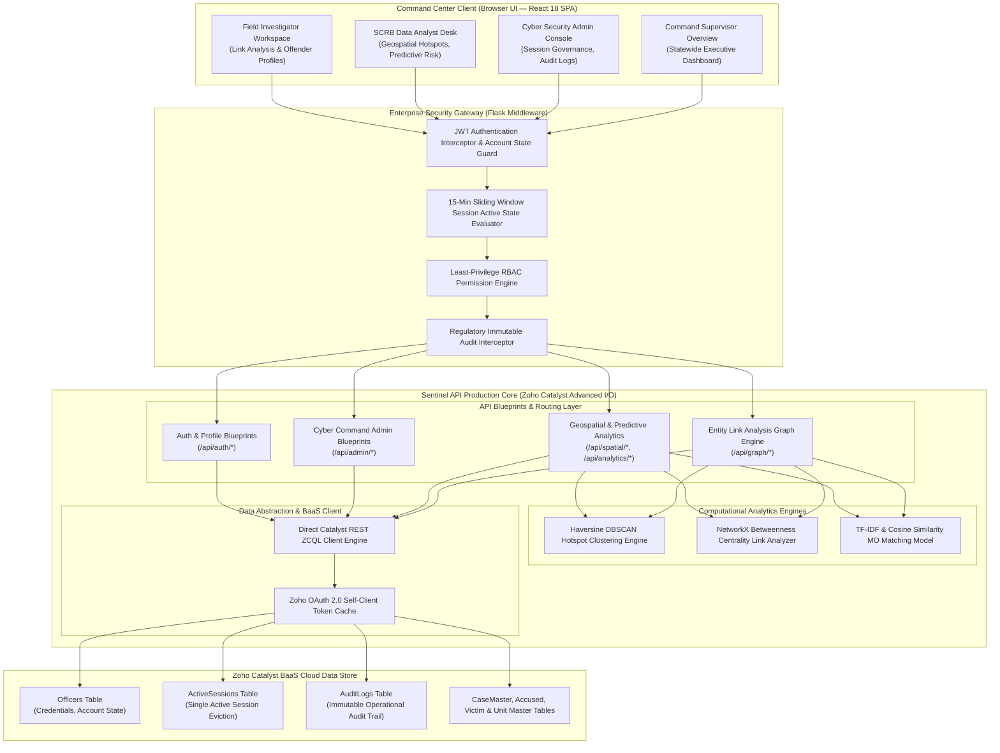
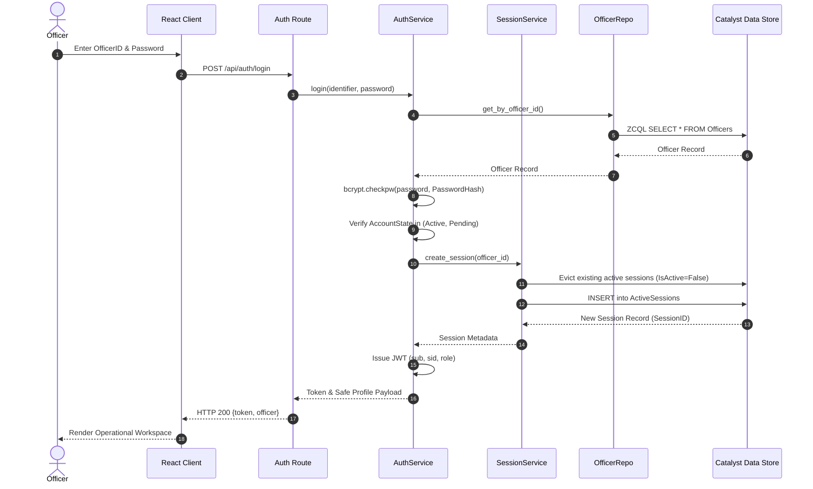
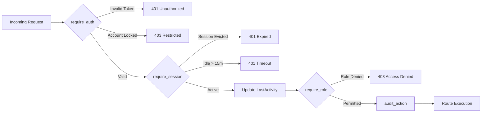
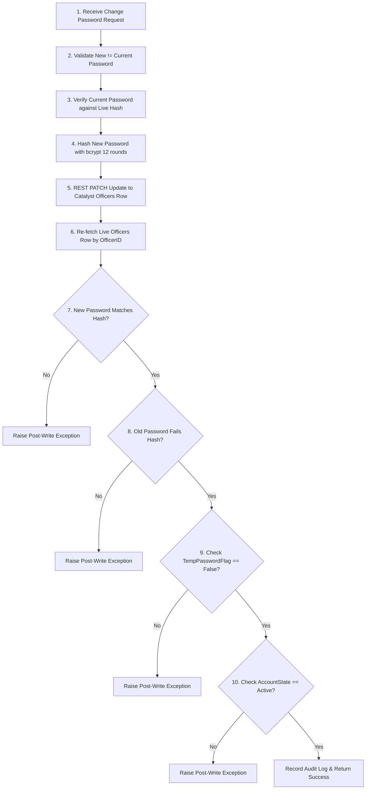

# Sentinel-KSP - Karnataka State Police Crime Intelligence & Cyber Command Platform

> **A serious, operational, government-grade command interface and serverless intelligence platform for statewide crime analytics, geospatial hotspot monitoring, entity-link investigation, predictive risk scoring, and cyber command administration.**

[](https://www.python.org/)
[](https://flask.palletsprojects.com/)
[](https://react.dev/)
[](https://www.zoho.com/catalyst/)
[](https://scikit-learn.org/)
[](https://tailwindcss.com/)
[](LICENSE)

---

## System Architecture Diagram

Below is the complete architectural layout illustrating the data flow, security boundaries, authentication pipeline, analytics engines, and the Zoho Catalyst BaaS persistence layers:



---

## Complete Technology Stack & Choices

| Layer | Technology | Selection Rationale & Cost Benefits |
| :--- | :--- | :--- |
| **Frontend Framework** | **React 18 SPA + React Router v6** | Single-page architecture delivers instantaneous view switching between command center modules, while client-side route guards enforce role-based workspace boundaries. |
| **Styling & UI System** | **Tailwind CSS + Framer Motion** | Institutional, government-grade dark mode interface built with cohesive visual hierarchy (*Inter* UI font, *JetBrains Mono* data font) and smooth sub-second animations. |
| **Visual Analytics** | **Leaflet, vis-network, Recharts** | Interactive GeoJSON map layers for hotspot visualization, force-directed entity graphs for criminal network exploration, and real-time trend charts. |
| **Backend API** | **Flask (Python 3.11)** | Lightweight modular framework wrapped as a serverless Zoho Catalyst Advanced I/O Function, delivering low latency and zero idle infrastructure costs. |
| **Auth & Governance** | **PyJWT + bcrypt + Middleware Pipeline** | 8-hour HMAC-SHA256 JWT tokens, 12-round bcrypt hashing, single active session enforcement with atomic eviction, and 15-minute sliding inactivity timeouts. |
| **Geospatial Engine** | **Scikit-Learn (DBSCAN)** | Haversine distance clustering on latitude/longitude coordinates generates precise spatial crime hotspots ($\varepsilon = 2.0\text{km}, \text{MinPts} = 3$). |
| **Link Analytics Engine** | **NetworkX** | Constructs multi-jurisdictional suspect-to-case networks and calculates betweenness centrality ($C_B(v)$) to isolate major criminal hubs. |
| **Predictive Analytics** | **Scikit-Learn (TF-IDF + Cosine Similarity)** | Vectorizes modus operandi (MO) incident text to discover cross-station serial crime signatures above similarity threshold $\theta = 0.35$. |
| **Cloud Data BaaS** | **Zoho Catalyst Data Store (REST ZCQL)** | Relational BaaS queried directly via authenticated REST ZCQL endpoints (`https://api.catalyst.zoho.in/baas/v1/project/{id}/query`), bypassing SDK SSL quirks. |

---

## Table of Contents

- [System Architecture Diagram](#system-architecture-diagram)
- [Complete Technology Stack & Choices](#complete-technology-stack--choices)
- [High-Level Design (HLD) Specification](#high-level-design-hld-specification)
  - [HLD 1 — Executive Summary & System Philosophy](#hld-1--executive-summary--system-philosophy)
  - [HLD 2 — Multi-Tier System Architecture](#hld-2--multi-tier-system-architecture)
  - [HLD 3 — Authentication, Session Lifecycle & Cryptographic Verification](#hld-3--authentication-session-lifecycle--cryptographic-verification)
  - [HLD 4 — Role-Based Access Control (RBAC) Matrix](#hld-4--role-based-access-control-rbac-matrix)
  - [HLD 5 — Computational Analytics Formulations](#hld-5--computational-analytics-formulations)
  - [HLD 6 — Datastore Schema Architecture](#hld-6--datastore-schema-architecture)
  - [HLD 7 — Verification & Build Integrity](#hld-7--verification--build-integrity)
- [Modules Overview](#modules-overview)
- [Getting Started & Local Execution](#getting-started--local-execution)
- [API Reference](#api-reference)
- [Repository Layout](#repository-layout)
- [License](#license)

---

## High-Level Design (HLD) Specification

> **Official Design Document**: Available as a dedicated file in [`docs/HLD.md`](docs/HLD.md) and mirrored below.

### HLD 1 — Executive Summary & System Philosophy

**Sentinel-KSP** is designed as a mission-critical operational intelligence platform for the Karnataka State Police. The platform operates on four non-negotiable architectural pillars:

1. **Zero-Trust Administrative & Session Governance**: Every incoming request undergoes mandatory non-cached token verification, live session active-state evaluation against Catalyst Data Store, 15-minute sliding inactivity window enforcement, and strict RBAC permission validation.
2. **Institutional & Regulatory Integrity**: Strict audit logging of all administrative and analytical interactions. Cryptographic 10-step post-write hash verification on credential mutations.
3. **Decoupled Monorepo Architecture**: Clean separation between a high-performance React 18 SPA client layer and a stateless Flask REST API hosted as a Zoho Catalyst Advanced I/O Function.
4. **Resilient BaaS Data Engine**: Dual-mode data access layer using direct Zoho Catalyst BaaS REST ZCQL API endpoints with OAuth 2.0 token caching and automatic fallback to mock datastores when credentials are not configured.

---

### HLD 2 — Multi-Tier System Architecture

```text
┌──────────────────────────────────────────────────────────────┐
│            Command Center Client (React 18 SPA)              │
│  AuthContext → Guards → AppShell → Permission-Gated Pages    │
└────────────────────────┬─────────────────────────────────────┘
                         │ HTTPS JSON (Bearer JWT)
                         ▼
┌──────────────────────────────────────────────────────────────┐
│         Enterprise Security Gateway (Flask Middleware)        │
│  require_auth → require_session → require_role → audit_action│
└────────────────────────┬─────────────────────────────────────┘
                         │ Validated Internal Execution
                         ▼
┌──────────────────────────────────────────────────────────────┐
│           Sentinel API Production Core (Flask Engine)         │
│  Blueprints: Auth · Admin · Dashboard · Spatial · Graph       │
│  Services: Geospatial (DBSCAN) · Link (NetworkX) · MO (TFIDF) │
└────────────────────────┬─────────────────────────────────────┘
                         │ Direct REST ZCQL Query Payload
                         ▼
┌──────────────────────────────────────────────────────────────┐
│           Zoho Catalyst Data Store (Cloud Relational)         │
│  Tables: Officers · ActiveSessions · AuditLogs · CaseMaster  │
└──────────────────────────────────────────────────────────────┘
```

---

### HLD 3 — Authentication, Session Lifecycle & Cryptographic Verification

#### 3a. Single Active Session Policy & Eviction Flow



#### 3b. Middleware Pipeline Execution



#### 3c. 10-Step Cryptographic Credential Post-Write Verification



---

### HLD 4 — Role-Based Access Control (RBAC) Matrix

| Role | Domain Authority | Granted Permissions |
| :--- | :--- | :--- |
| **CyberSecurityAdministrator** | Complete administrative governance, officer provisioning, session termination, audit log review, emergency access, and incident resolution. | `OFFICER_CREATE`, `OFFICER_LOCK`, `OFFICER_UNLOCK`, `OFFICER_DISABLE`, `PASSWORD_RESET`, `SESSION_FORCE_LOGOUT`, `SESSION_VIEW`, `AUDIT_VIEW`, `EMERGENCY_ACCESS_GRANT`, `EMERGENCY_ACCESS_END`, `SECURITY_INCIDENT_VIEW`, `SECURITY_INCIDENT_RESOLVE`, `DASHBOARD_VIEW`, `GEOSPATIAL_VIEW`, `LINK_ANALYSIS_VIEW`, `PREDICTIVE_VIEW`, `CASE_READ` |
| **SCRBDataAnalyst** | Operational crime intelligence, spatial hotspot monitoring, predictive risk scoring, MO similarity clustering, case creation & modification. | `CASE_READ`, `CASE_WRITE`, `DASHBOARD_VIEW`, `GEOSPATIAL_VIEW`, `LINK_ANALYSIS_VIEW`, `PREDICTIVE_VIEW` |
| **FieldInvestigator** | Criminological link analysis, offender profile exploration, and case search. | `CASE_READ`, `LINK_ANALYSIS_VIEW` |
| **CommandSupervisor** | High-level executive overview and statewide KPI monitoring. | `DASHBOARD_VIEW` |
| **SystemAdministrator** | Infrastructure level health monitoring (no operational business permissions). | *None (Empty frozenset per least-privilege principle)* |

---

### HLD 5 — Computational Analytics Formulations

#### 5a. Geospatial DBSCAN Hotspot Clustering

Given FIR incident coordinates $P = \{p_1, p_2, \dots, p_n\}$ where $p_i = (\text{lat}_i, \text{lon}_i)$, coordinates are converted to spherical radians:

$$\phi_i = \text{lat}_i \times \frac{\pi}{180}, \quad \lambda_i = \text{lon}_i \times \frac{\pi}{180}$$

Pairwise distances are calculated via the **Haversine Formula**:

$$d(p_i, p_j) = 2R \arcsin \left( \sqrt{\sin^2\left(\frac{\phi_j - \phi_i}{2}\right) + \cos(\phi_i)\cos(\phi_j)\sin^2\left(\frac{\lambda_j - \lambda_i}{2}\right)} \right)$$

where $R = 6371.0088\text{ km}$. Spatial clusters are identified using `DBSCAN(eps=2.0/6371.0088, min_samples=3, metric='haversine')`.

#### 5b. NetworkX Betweenness Centrality Link Analysis

Given criminal network graph $G = (V, E)$ where $V = V_{\text{Case}} \cup V_{\text{Accused}}$, Betweenness Centrality $C_B(v)$ isolates key criminal hubs:

$$C_B(v) = \sum_{s \neq v \neq t \in V} \frac{\sigma_{st}(v)}{\sigma_{st}}$$

where $\sigma_{st}$ is the total number of shortest paths from $s$ to $t$, and $\sigma_{st}(v)$ is the number of those paths passing through vertex $v$.

#### 5c. Modus Operandi TF-IDF Cosine Similarity Matching

Case MO text corpus $D$ is vectorized using term frequency-inverse document frequency (TF-IDF):

$$\text{TF-IDF}(t, d, D) = \text{TF}(t, d) \times \log \left( \frac{|D|}{1 + |\{d' \in D : t \in d'\}|} \right)$$

Pairwise MO similarity score is evaluated as:

$$\text{Sim}(A, B) = \frac{\mathbf{v}_A \cdot \mathbf{v}_B}{\|\mathbf{v}_A\|_2 \|\mathbf{v}_B\|_2}$$

Case pairs exceeding threshold $\theta = 0.35$ are flagged as potential serial MO signature matches.

---

### HLD 6 — Datastore Schema Architecture

```text
+-----------------------+       +-----------------------+       +-----------------------+
|       Officers        |       |    ActiveSessions     |       |       AuditLogs       |
+-----------------------+       +-----------------------+       +-----------------------+
| ROWID (PK)            |<------| ROWID (PK)            |       | ROWID (PK)            |
| OfficerID (UK)        |       | SessionID (UK)        |       | AuditID (UK)          |
| FullName              |       | OfficerID (FK)        |       | Timestamp             |
| EmployeeID (UK)       |       | IsActive (Boolean)    |       | ActorOfficerID        |
| PasswordHash          |       | LastActivityTime      |       | Action                |
| TempPasswordFlag      |       | IPAddress             |       | ResourceType          |
| PasswordLastChanged   |       | DeviceFingerprint     |       | ResourceID            |
| Role                  |       +-----------------------+       | Inference             |
| District              |                                       | IPAddress             |
| Rank                  |       +-----------------------+       | DeviceFingerprint     |
| Station               |       |      CaseMaster       |       | ExtraMetadata (JSON)  |
| Department            |       +-----------------------+       +-----------------------+
| AccountState          |       | ROWID (PK)            |
| CreatedBy             |       | CaseID (UK)           |
+-----------------------+       | FIRNumber             |       +-----------------------+
                                | District              |       |        Accused        |
                                | PoliceStation         |       +-----------------------+
                                | Latitude / Longitude  |       | ROWID (PK)            |
                                | OffenseDate           |       | AccusedID (UK)        |
                                | CrimeGroup            |       | CaseID (FK)           |
                                | CrimeHead             |       | Name / Age / Gender   |
                                | ModusOperandi         |       | ArrestStatus          |
                                +-----------------------+       | KnownAliases          |
                                                                +-----------------------+
```

---

### HLD 7 — Verification & Build Integrity

| Test Tier | Verification Command | Status / Standard |
| :--- | :--- | :--- |
| **Backend Unit Tests** | `python -m unittest discover -s functions/sentinel_api/tests -v` | **21/21 Passed** (Auth, RBAC, Eviction, Post-Write) |
| **Frontend Production Build** | `cd client && npm run build` | **Clean Build** (0 errors, 0 warnings) |

---

## Modules Overview

### Crime Intelligence & Analytics
- **Statewide Dashboard**: Real-time aggregated KPIs across all 31 Karnataka police districts.
- **Geospatial Intelligence**: Leaflet-powered GeoJSON maps displaying DBSCAN density clusters.
- **Predictive Risk Scoring**: Composite threat risk index evaluating crime velocity and clearance deficit.
- **Behavioral Anomaly Detection**: Statistical anomaly flags across station incident rates.

### Link Analysis & Investigation
- **Entity Network Graph**: vis-network force-directed graph rendering suspect-to-case connections.
- **Repeat Offender Profiles**: Joined criminal footprints across multiple police jurisdictions.
- **MO Signature Matching**: TF-IDF cosine similarity search identifying serial modus operandi.

### Cyber Command Center (Admin)
- **Officer Management**: Account creation, temporary credentials, lock/unlock, and disabling.
- **Active Session Governance**: Real-time list of all active sessions with forced remote logout.
- **Immutable Audit Logs**: Comprehensive regulatory log viewer with filtering by actor and action.
- **Emergency Access**: Controlled, time-bound access escalation with mandatory justification.

---

## Getting Started & Local Execution

### Prerequisites
- **Python 3.11+**
- **Node.js 18+ & npm**
- Zoho Catalyst account (optional for local mock execution)

### 1. Setup Environment
Clone the repository and create `.env` at root:
```bash
git clone https://github.com/Abhirupmandal/Sentinel-KSP.git
cd Sentinel-KSP
```

`.env` configuration:
```env
CATALYST_PROJECT_ID=your_project_id
CATALYST_PROJECT_KEY=your_project_key
ZC_SDK_CLIENT_ID=your_self_client_id
ZC_SDK_CLIENT_SECRET=your_self_client_secret
ZC_SDK_REFRESH_TOKEN=your_self_client_refresh_token
CATALYST_ENV=Development
JWT_SECRET_KEY=your_jwt_secret
```

### 2. Start Backend API
```bash
pip install -r requirements.txt
python functions/sentinel_api/main.py
```
*API server runs on `http://localhost:5000`.*

### 3. Start Frontend Client
```bash
cd client
npm install
npm start
```
*React app opens on `http://localhost:3000`.*

---

## API Reference

| Endpoint | Method | Role Required | Description |
| :--- | :--- | :--- | :--- |
| `/api/auth/login` | POST | Public | Authenticates officer and issues JWT token |
| `/api/auth/logout` | POST | Authenticated | Terminates active session |
| `/api/auth/change-password` | PUT | Authenticated | Mandatory password change with 10-step verification |
| `/api/admin/create-user` | POST | CyberSecurityAdmin | Provisions new officer account |
| `/api/admin/active-sessions` | GET | CyberSecurityAdmin | Lists all active authenticated sessions |
| `/api/admin/force-logout` | POST | CyberSecurityAdmin | Forcefully terminates an active session |
| `/api/admin/audit-logs` | GET | CyberSecurityAdmin | Queries immutable operational audit trail |
| `/api/dashboard/stats` | GET | DASHBOARD_VIEW | Statewide aggregated crime KPIs |
| `/api/spatial/hotspots` | GET | GEOSPATIAL_VIEW | GeoJSON DBSCAN hotspot clusters |
| `/api/graph/network` | GET | LINK_ANALYSIS_VIEW | Nodes and edges for entity network graph |
| `/api/analytics/mo-clusters` | GET | PREDICTIVE_VIEW | Pairwise MO similarity clusters ($\theta \ge 0.35$) |

---

## Repository Layout

```text
sentinel-ksp/
├── LICENSE                        # Apache License 2.0
├── README.md                      # Primary project documentation
├── catalyst.json                  # Zoho Catalyst project manifest
├── requirements.txt               # Python dependencies
├── docs/
│   └── HLD.md                     # High-Level Design specification document
│
├── client/                        # React 18 SPA Frontend
│   ├── package.json
│   ├── src/
│   │   ├── App.js                 # Router & Protected Route Pipeline
│   │   ├── index.css              # Design tokens, typography & Tailwind
│   │   ├── context/               # AuthContext, ThemeContext, ToastContext
│   │   ├── components/            # AppShell, NavHeader, StatsBar, Graphs
│   │   ├── pages/                 # Admin, Analytics & Investigation Pages
│   │   └── lib/                   # API clients & RBAC helpers
│
└── functions/
    └── sentinel_api/              # Flask Backend Service
        ├── main.py                # Flask app factory & blueprint registration
        ├── config.py              # Catalyst SDK & REST ZCQL client initialization
        ├── constants/             # Roles, Permissions, Ranks, Departments
        ├── core/                  # CatalystClient, JWTManager, PasswordManager
        ├── middleware/            # require_auth, require_session, require_role
        ├── repositories/          # Officers, Sessions, Audit, Cases, Accused
        ├── services/              # Auth, Officer, Geospatial, LinkAnalysis, Predictive
        ├── routes/                # Blueprint route controllers
        └── tests/                 # 21 Unit & Integration test suites
```

---

## License

This project is licensed under the [Apache License 2.0](LICENSE).
