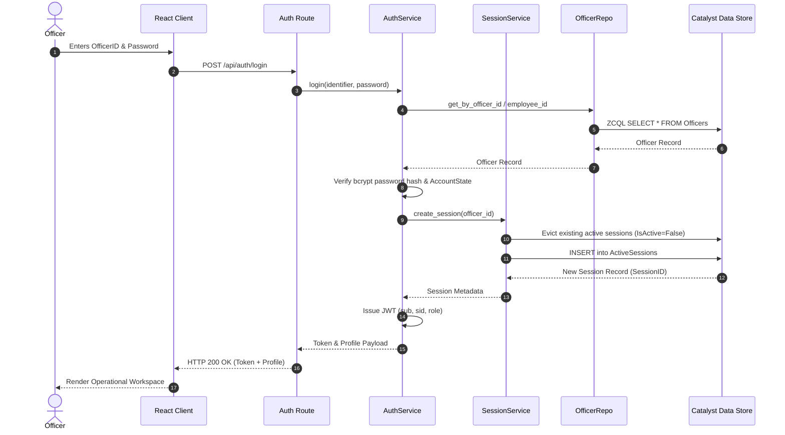
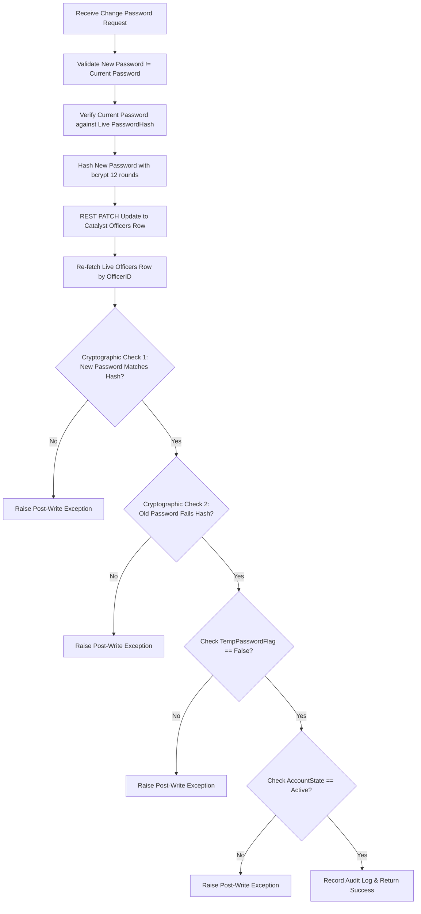

# High-Level Design (HLD) Specification — Sentinel-KSP

**Karnataka State Police — Crime Intelligence & Cyber Command Platform**  
**Document Version:** 2.4.0  
**Security Classification:** RESTRICTED — FOR OFFICIAL USE ONLY  

---

## 1. Executive Summary & Architectural Goals

**Sentinel-KSP** is an enterprise-grade, government-class crime intelligence, spatial analytics, and cyber command platform engineered for the **Karnataka State Police (KSP)**. The platform aggregates multi-jurisdictional crime records across state districts, providing real-time situational awareness, computational geospatial hotspot clustering, link analysis graph visualization, modus operandi (MO) similarity matching, and predictive risk indices.

### Key Architectural Principles

1. **Zero-Trust Administrative & Session Governance**: Every incoming request undergoes mandatory non-cached token verification, live session active-state evaluation against Catalyst Data Store, 15-minute sliding window inactivity enforcement, and strict RBAC permission validation.
2. **Institutional & Regulatory Integrity**: Strict audit logging of all administrative and analytical interactions. Cryptographic 10-step post-write hash verification on credential mutations.
3. **Decoupled Monorepo Architecture**: Clean separation between a high-performance React 18 SPA client layer and a stateless Flask REST API hosted as a Zoho Catalyst Advanced I/O Function.
4. **Resilient BaaS Data Engine**: Dual-mode data access layer using direct Zoho Catalyst BaaS REST ZCQL API endpoints with OAuth 2.0 token caching and automatic fallback to mock datastores in unconfigured environments.

---

## 2. Multi-Tier System Architecture

```mermaid
graph TD
    %% Roles & Access Workspaces
    subgraph ClientDesk ["Command Center Client (Browser UI — React 18 SPA)"]
        FieldUI["Field Investigator Workspace<br/>(Link Analysis & Offender Profiles)"]
        AnalystUI["SCRB Data Analyst Desk<br/>(Geospatial Hotspots, Predictive Risk)"]
        AdminUI["Cyber Security Admin Console<br/>(Session Governance, Audit Logs)"]
        SuperUI["Command Supervisor Overview<br/>(Statewide Executive Dashboard)"]
    end

    %% Routing & Security Pipeline
    subgraph SecurityGateway ["Enterprise Security Gateway (Flask Middleware)"]
        JWTAuth["JWT Authentication Interceptor & Account State Guard"]
        SessGuard["15-Min Sliding Window Session Active State Evaluator"]
        RBACEngine["Least-Privilege RBAC Permission Engine"]
        AuditLogger["Regulatory Immutable Audit Interceptor"]
    end

    %% Application Core & Services
    subgraph SentinelCore ["Sentinel API Production Core (Zoho Catalyst Advanced I/O)"]
        subgraph APIBlueprints ["API Blueprints & Routing Layer"]
            AuthBP["Auth & Profile Blueprints<br/>(/api/auth/*)"]
            AdminBP["Cyber Command Admin Blueprints<br/>(/api/admin/*)"]
            AnalyticsBP["Geospatial & Predictive Analytics<br/>(/api/spatial/*, /api/analytics/*)"]
            GraphBP["Entity Link Analysis Graph Engine<br/>(/api/graph/*)"]
        end
        
        subgraph ComputationalEngines ["Computational Analytics Engines"]
            SpatialDBSCAN["Haversine DBSCAN Hotspot Clustering Engine"]
            NetworkGraph["NetworkX Betweenness Centrality Link Analyzer"]
            TFIDFEngine["TF-IDF & Cosine Similarity MO Matching Model"]
        end

        subgraph DataAbstraction ["Data Abstraction & BaaS Client"]
            RestZCQL["Direct Catalyst REST ZCQL Client Engine"]
            OAuthManager["Zoho OAuth 2.0 Self-Client Token Cache"]
        end
    end

    %% Persistence & Storage Layer
    subgraph StorageBaaS ["Zoho Catalyst BaaS Cloud Data Store"]
        OfficersTable["Officers Table<br/>(Credentials, Account State)"]
        SessionsTable["ActiveSessions Table<br/>(Single Active Session Eviction)"]
        AuditTable["AuditLogs Table<br/>(Immutable Operational Audit Trail)"]
        CrimeTables["CaseMaster, Accused, Victim & Unit Master Tables"]
    end

    %% Connections & Data Flow
    FieldUI & AnalystUI & AdminUI & SuperUI --> JWTAuth
    JWTAuth --> SessGuard
    SessGuard --> RBACEngine
    RBACEngine --> AuditLogger
    AuditLogger --> AuthBP & AdminBP & AnalyticsBP & GraphBP
    AnalyticsBP & GraphBP --> SpatialDBSCAN & NetworkGraph & TFIDFEngine
    AuthBP & AdminBP & AnalyticsBP & GraphBP --> RestZCQL
    RestZCQL --> OAuthManager
    OAuthManager --> OfficersTable & SessionsTable & AuditTable & CrimeTables
```



---

## 3. Security, Authentication & Session Lifecycle

### 3.1 Single Active Session Policy & Token Issuance

To prevent concurrent account usage across unauthorized police workstations, Sentinel-KSP enforces a strict single-session rule per officer:

1. **Authentication Verification**: Identifies officer via `OfficerID` or `EmployeeID`, verifies `AccountState` (rejects `Locked`, `Disabled`, or `Retired`), and verifies password hash using bcrypt.
2. **Session Eviction**: Queries `ActiveSessions` table for existing `IsActive = true` records belonging to the officer. Any existing active session is immediately marked `IsActive = false`.
3. **Session Provisioning**: Inserts a new row in `ActiveSessions` containing `SessionID`, `IPAddress`, `DeviceFingerprint`, and `LastActivityTime`.
4. **JWT Issuance**: Issues an 8-hour JWT signed with HMAC-SHA256 containing `sub` (OfficerID), `sid` (SessionID), and `role`.



### 3.2 10-Step Cryptographic Credential Post-Write Verification

When an officer updates their password (first-login or administrative reset), Sentinel-KSP executes a zero-trust post-write verification flow to guarantee data store integrity:



---

## 4. Role-Based Access Control (RBAC) Matrix

The system enforces least-privilege access control across 5 defined roles and 17 granular permission scopes.

| Role | Scope & Domain Authority | Assigned Permissions |
|------|--------------------------|----------------------|
| **CyberSecurityAdministrator** | Identity management, session monitoring, account lifecycle, emergency access, audit review, security incident handling, full analytics read. | `OFFICER_CREATE`, `OFFICER_LOCK`, `OFFICER_UNLOCK`, `OFFICER_DISABLE`, `PASSWORD_RESET`, `SESSION_FORCE_LOGOUT`, `SESSION_VIEW`, `AUDIT_VIEW`, `EMERGENCY_ACCESS_GRANT`, `EMERGENCY_ACCESS_END`, `SECURITY_INCIDENT_VIEW`, `SECURITY_INCIDENT_RESOLVE`, `DASHBOARD_VIEW`, `GEOSPATIAL_VIEW`, `LINK_ANALYSIS_VIEW`, `PREDICTIVE_VIEW`, `CASE_READ` |
| **SCRBDataAnalyst** | Intelligence dashboards, spatiotemporal trend analysis, risk scoring, MO similarity clustering, case read/write. | `CASE_READ`, `CASE_WRITE`, `DASHBOARD_VIEW`, `GEOSPATIAL_VIEW`, `LINK_ANALYSIS_VIEW`, `PREDICTIVE_VIEW` |
| **FieldInvestigator** | Read-only criminological link analysis, repeat offender profiles, case history lookup. | `CASE_READ`, `LINK_ANALYSIS_VIEW` |
| **CommandSupervisor** | Executive dashboard overviews and high-level KPI monitoring. | `DASHBOARD_VIEW` |
| **SystemAdministrator** | Infrastructure monitoring (no operational business permissions). | *None (Empty frozenset per least-privilege)* |

---

## 5. Computational Analytics Formulations

### 5.1 Geospatial DBSCAN Hotspot Detection

Given a dataset of FIR case points $P = \{p_1, p_2, \dots, p_n\}$ where $p_i = (\text{lat}_i, \text{lon}_i)$, coordinates are converted to spherical radians:

$$\phi_i = \text{lat}_i \times \frac{\pi}{180}, \quad \lambda_i = \text{lon}_i \times \frac{\pi}{180}$$

Distance between points is computed using the **Haversine Distance Metric**:

$$d(p_i, p_j) = 2R \arcsin \left( \sqrt{\sin^2\left(\frac{\phi_j - \phi_i}{2}\right) + \cos(\phi_i)\cos(\phi_j)\sin^2\left(\frac{\lambda_j - \lambda_i}{2}\right)} \right)$$

where $R = 6371.0088\text{ km}$ (Earth radius). Clustering is evaluated via Scikit-Learn `DBSCAN(eps=2.0 / 6371.0088, min_samples=3, metric='haversine')`.

### 5.2 NetworkX Link Analysis & Betweenness Centrality

The entity network graph is represented as an undirected graph $G = (V, E)$, where vertex set $V = V_{\text{Case}} \cup V_{\text{Accused}}$ and edges $E$ represent `LINKED_TO` relationships.

Betweenness centrality $C_B(v)$ for node $v \in V$ is calculated to identify high-risk offender hubs:

$$C_B(v) = \sum_{s \neq v \neq t \in V} \frac{\sigma_{st}(v)}{\sigma_{st}}$$

where $\sigma_{st}$ is the total number of shortest paths from node $s$ to node $t$ and $\sigma_{st}(v)$ is the number of those paths that pass through $v$.

### 5.3 Modus Operandi (MO) Cosine Similarity

The corpus of case MO descriptions $D = \{d_1, d_2, \dots, d_m\}$ is transformed into term frequency-inverse document frequency (TF-IDF) feature vectors $\mathbf{v}_i \in \mathbb{R}^k$:

$$\text{TF-IDF}(t, d, D) = \text{TF}(t, d) \times \log \left( \frac{|D|}{1 + |\{d' \in D : t \in d'\}|} \right)$$

Pairwise similarity between cases $A$ and $B$ is computed as:

$$\text{Sim}(A, B) = \frac{\mathbf{v}_A \cdot \mathbf{v}_B}{\|\mathbf{v}_A\|_2 \|\mathbf{v}_B\|_2}$$

Pairs exceeding threshold $\theta = 0.35$ are tagged as potential serial MO signature matches.

---

## 6. Datastore Schema Architecture

```text
+-----------------------+       +-----------------------+       +-----------------------+
|       Officers        |       |    ActiveSessions     |       |       AuditLogs       |
+-----------------------+       +-----------------------+       +-----------------------+
| ROWID (PK)            |<------| ROWID (PK)            |       | ROWID (PK)            |
| OfficerID (UK)        |       | SessionID (UK)        |       | AuditID (UK)          |
| FullName              |       | OfficerID (FK)        |       | Timestamp             |
| EmployeeID (UK)       |       | IsActive (Boolean)    |       | ActorOfficerID        |
| PasswordHash          |       | LastActivityTime      |       | Action                |
| TempPasswordFlag      |       | IPAddress             |       | ResourceType          |
| PasswordLastChanged   |       | DeviceFingerprint     |       | ResourceID            |
| Role                  |       +-----------------------+       | Inference             |
| District              |                                       | IPAddress             |
| Rank                  |       +-----------------------+       | DeviceFingerprint     |
| Station               |       |      CaseMaster       |       | ExtraMetadata (JSON)  |
| Department            |       +-----------------------+       +-----------------------+
| AccountState          |       | ROWID (PK)            |
| CreatedBy             |       | CaseID (UK)           |
+-----------------------+       | FIRNumber             |       +-----------------------+
                                | District              |       |        Accused        |
                                | PoliceStation         |       +-----------------------+
                                | Latitude / Longitude  |       | ROWID (PK)            |
                                | OffenseDate           |       | AccusedID (UK)        |
                                | CrimeGroup            |       | CaseID (FK)           |
                                | CrimeHead             |       | Name / Age / Gender   |
                                | ModusOperandi         |       | ArrestStatus          |
                                +-----------------------+       | KnownAliases          |
                                                                +-----------------------+
```

---

## 7. Verification & Build Integrity

| Test Tier | Verification Command | Status / Standard |
| :--- | :--- | :--- |
| **Backend Unit Tests** | `python -m unittest discover -s functions/sentinel_api/tests -v` | **21/21 Passed** (Auth, RBAC, Eviction, Post-Write) |
| **Frontend Production Build** | `cd client && npm run build` | **Clean Build** (0 errors, 0 warnings) |
